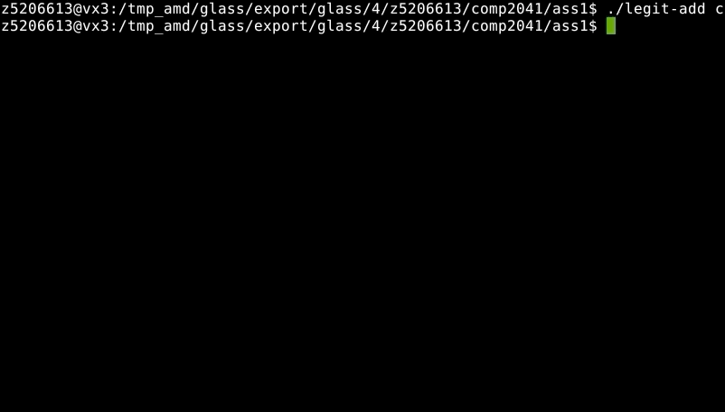

# Git Replica 
A simulation of git terminal commands and system using local folders, written in Shell and Perl.

Harder commands such as Merge, Branch and Checkout are not completed and do experience bugs as outlined in the tests provided. 

## Instructions 
1. Download the repository
2. Type commands such as ./legit-add <filename>. Make sure to init first, usage errors are provided
  

